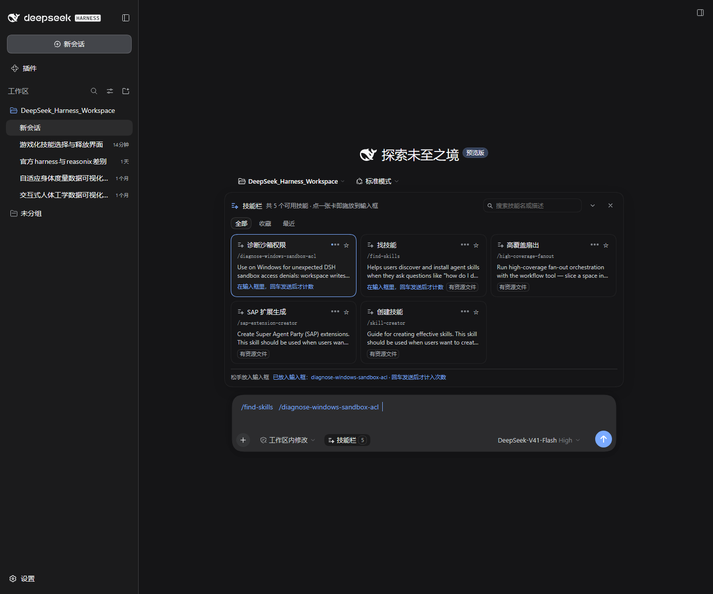

# dsh-client-ui-skill-bar

A skill bar for the DSH web GUI. Every user-invocable skill of the current session becomes a card you can search, favorite, and cast into the composer as `/<name>` with a click or a drag.

[中文说明](README.zh.md)



## Behaviour

Two seats:

- In the composer tool row: a **Skills** button with the usable-skill count; it opens and closes the panel.
- Above the composer: the panel — a search field, the `All / Favorites / Recent` views, and a card grid.

A card shows its display label (built-in map or your config), the literal `/<kebab-name>`, the skill's own description, tags (user-only, has resources), and how many times you have sent it.

Four behaviours worth knowing before you rely on them:

**Casting only writes the draft; it never sends.** Clicking a card appends `/skill-name ` to the draft and keeps what you already typed; dragging a card onto the composer does the same. You press Enter. This is not caution for its own sake: the Host injects the skill body because of that literal `/name` in the message, so sending on your behalf would change what a step actually injected.

**The count follows the send.** After a cast the card says the token is sitting in the composer and will be counted once sent. It increments only when that token leaves the draft. Cast, then delete: not counted. A pending mark that never gets sent expires after ten minutes.

**Dragging does not select text.** Card text is unselectable and the drag is a pointer gesture: a ghost follows the cursor, the composer highlights as the drop target, and the cast happens on release.

**Opening the panel puts focus in the search field.** You can type to filter right away; casting hands focus back to the composer so you can press Enter. `Enter` casts the highlighted card, `↑`/`↓` move, `Esc` closes.

Favorites, recents and sent counts live in the browser's `localStorage`. They affect this panel's ordering and display only — the plugin writes no skill file and changes nothing about what the agent sees.

## Compatibility

- DSH web surface (the desktop app and the `web` profile). Client-only.
- Requires `react` and `react/jsx-runtime` at runtime, nothing else. The icons are inline SVG owned by this repo, so no internal SDK package is involved. No CSS build, no bundler.
- Verified against DSH `0.2.0-rc.2` on both the Electron desktop app and `dsh web`.
- Host interfaces it uses: the `skills/list` Remote, the `conversation.input.left` and `conversation.input.dock` slots, and the `inputActions` / `useInput` slot props. Those four names are the only real upgrade risk. If one is renamed, failure is contained: the panel reports a catalog read error and the composer keeps working.

## Install

The plugin is an ordinary npm package mounted through a profile's Loader patch, the same path DSH's own UI plugins take.

### 1. Get the code

```sh
git clone https://github.com/<you>/dsh-skill-bar.git
```

Or `npm install dsh-client-ui-skill-bar` and mount it by package specifier.

### 2. Add one row to your profile

Edit `$DSH_HOME/profiles/<profile>/cordis.patch.yml` (`%USERPROFILE%\.dsh\profiles\desktop\cordis.patch.yml` on Windows):

```yaml
- insert:
    - id: dsh-client-ui-skill-bar
      name: 'C:\path\to\dsh-client-ui-skill-bar\lib\index.js'
      config:
        label: Skills
        cooldownMs: 900
        maxHeight: 420
        labels:
          skill-creator: Create a skill
```

`name` must point at the **entry file**, not the directory. A patch insert name is imported as an ES module and Node rejects directory imports (`ERR_UNSUPPORTED_DIR_IMPORT`). The patch loader turns an absolute path into a file URL; a bare package specifier also works when the package resolves from the profile.

### 3. Restart the app

A profile's patch layer is composed at process start, so restart the DSH app (or the `dsh web` process) once. The skill bar then appears above the composer in every session.

If it does not show up, read `%DSH_HOME%\logs\startup-*.log`. A plugin that fails to activate reports only a state word at startup; the actual reason is in that file.

## Configuration

Every field is optional. Defaults in parentheses.

| Field | Meaning |
|---|---|
| `label` (follows the UI language) | Composer button text |
| `cooldownMs` (900) | Per-skill anti-double-cast window, milliseconds |
| `maxHeight` (420) | Panel height budget, pixels |
| `labels` (built-in map) | Per-skill display name, keyed by the exact skill name |
| `descriptions` (the skill's own) | Per-skill description override |

```yaml
      config:
        labels:
          skill-creator: 创建技能
        descriptions:
          skill-creator: 写新 skill 时用
```

## Why the skill names are ASCII

A skill's `name` is its invocation id and the Host enforces kebab-case ASCII (`/^[a-z0-9]+(?:-[a-z0-9]+)*$/`). Renaming a skill to Chinese would break `/name` resolution, so readability has to happen in a display layer, in this order:

1. `config.labels` from your profile patch;
2. the plugin's built-in map;
3. the raw name.

Search matches the display label, the skill name and the description. Every card keeps the original `/<name>` visible, because that is what the Host resolves.

## Where skills live

The panel reads the merged catalog through the Host's `skills/list` Remote. Local skills are `SKILL.md` files (YAML frontmatter plus a Markdown body, optionally with `references/` and `scripts/`, or a flat `*.md`), discovered under:

- `<project>/.dsh/skills`
- `<project>/.agents/skills`
- `customSkillDirs` from the profile patch or settings
- `$DSH_HOME/skills`
- `$DSH_AGENTS_HOME/skills` (defaults to `~/.agents/skills`)
- the bundled skill directory of the active agent preset

Editing a `SKILL.md` takes effect on the next catalog read; no restart needed. Do not rename the `name` field — `/name` would stop resolving.

## Development

There is no build step. The DSH client module system evaluates the bundle as a plain classic script, so `lib/client.js` is the artifact and it is committed. What a release needs is a check that the artifact is still loadable and still self-contained, which is `build.mjs`.

```sh
npm install                 # react / react-dom, for the tests only

npm test                    # artifact check + offline behaviour test
node build.mjs --check      # artifact check only

# Real-page verification against a running GUI (Chrome/Edge started with
# --remote-debugging-port=9222):
node browser-check.mjs 9222 'http://127.0.0.1:3080/?token=...' out.png
node capture.mjs 9222 'http://127.0.0.1:3080/?token=...' docs/screenshot.png
```

`npm test` needs React. It looks in `DSH_REACT_DIR`, then `$DSH_HOME/profiles/node_modules`, then this package's own `node_modules`:

```sh
DSH_REACT_DIR=/path/to/dsh/profiles/node_modules npm test
```

What each file is for:

| Path | Role |
|---|---|
| `lib/index.js` | Host half: an empty `apply`, so the plugin occupies a Loader entry |
| `lib/client.js` | Browser half: one artifact, nothing required beyond React |
| `build.mjs` | Artifact check: parses, module id equals the package name, require allowlist, `//#region` completeness, `files` exist, bundle committed |
| `smoke-test.mjs` | Offline behaviour test: fake Cordis context + `react-dom/server` |
| `browser-check.mjs` | Real-page verification: CDP driving the real input pipeline, 25 assertions |
| `capture.mjs` | README screenshot |

`lib/client.js` is organised as `//#region` blocks (`locale`, `icons`, `storage`, `store`, `match`, `style`, `ui`, `catalog`, `components`, `index`), and the artifact check asserts all of them are present.

## Sharp edges when writing a DSH plugin

Each of these cost real debugging time.

1. **A patch `insert.name` is an ES module specifier.** Point it at the entry file, never the directory, or you get `ERR_UNSUPPORTED_DIR_IMPORT`.
2. **The bundle's registered `id` must equal the package name the Host resolves.** Mounted by path, that name is the **directory name**, not the npm scope you may have intended. A mismatch fails with `loaded without registering "<id>" via __ModuleLoader__.load`.
3. **`ctx.config` is not a plain property in Cordis 4.** Reading it without the declarative inject throws `cannot get property "config" without inject`. Read it behind a try/catch and fall back to defaults.
4. **A component with hooks must not `return null` mid-render.** The slot host turns that shape into a React hook-state error (#310) when the panel first opens. Split it: an outer seat that subscribes to the open flag and returns `null`, plus a body component that mounts and unmounts for real.
5. **Do not publish to a store the same component subscribes to from inside an effect.** It lands in React's commit phase; defer it one microtask.
6. **A follow-me effect written as a direct DOM style mutation gets overwritten.** The drag ghost originally set `node.style.transform`; the next React commit wiped it, so the ghost appeared but never followed the pointer. Keep the position in state.
7. **Confirm theme tokens exist before using them.** An unknown token resolves to `unset` silently, which in a dark theme is light text on a light background. `0.2.0-rc.2` has no `--dsw-alias-bg-l1/l2/l3`; carry selection with border color instead.

## Known limitations

- Only **user-invocable** skills are listed (that is how the Host's `skills/list` filters), so a `disable-model-invocation` skill appears here. This panel is one of its few entry points.
- Casting goes through `setDraft`, so it writes the whole draft and the caret lands at the end.
- The catalog is read per session; a session that is not open surfaces a read error inside the panel.
- Disabling or uninstalling the plugin leaves `dsh.skillBar.v1.*` keys in `localStorage` behind.

## License

MIT, see [LICENSE](LICENSE).
